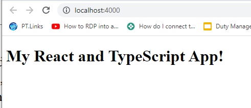

<!--Category:GAS--> 
 

    <a href="http://productivitytools.tech/"><a> 
    

    

# Learning - TypeScript - Babel

This is basic and core configuration of the Babel and webpack with typescript

<!--more-->

I did it manually step by step with the book **Carl Rippon - Learn React with TypeScript A beginner's guide to reactive web development with React 18 and TypeScript**

Commands 
- npm run start
- npm install --save-dev package

